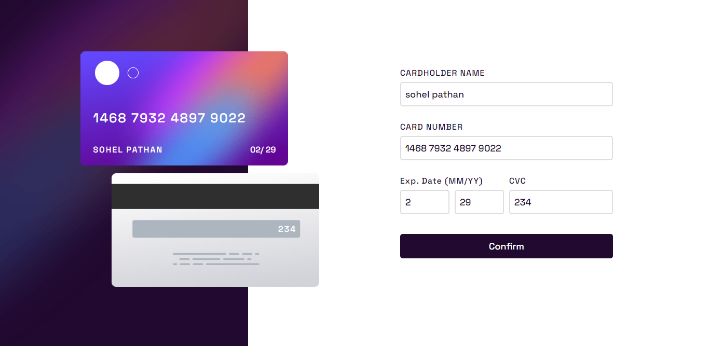

# Interactive card details form

## The challenge

- Fill in the form and see the card details update in real-time
- Receive error messages when the form is submitted if:
  - Any input field is empty
  - The card number, expiry date, or CVC fields are in the wrong format
- View the optimal layout depending on their device's screen size
- See hover, active, and focus states for interactive elements on the page

### Expected behaviour

- Update the details on the card as the user fills in the fields
- Validate the form fields when the form is submitted
- If there are no errors, display the completed state
- Reset the form when the user clicks "Continue" on the completed state

### Information 
- this is a solution to the [Interactive card details form ](https://www.frontendmentor.io/challenges/interactive-card-details-form-XpS8cKZDWw/hub/interactive-card-detail-form-l_MsaE35BK).
- by [Frontend Mentor](https://www.frontendmentor.io)

## Links

- [Solution URL](https://github.com/sohel08/)
- [Live Site URL]()

## Built with

- CSS custom properties
- Flex-box
- Mobile-first workflow
- Vanilla JavaScript

## Author

- Frontend Mentor - [@sohel08](https://www.frontendmentor.io/profile/sohel08)
